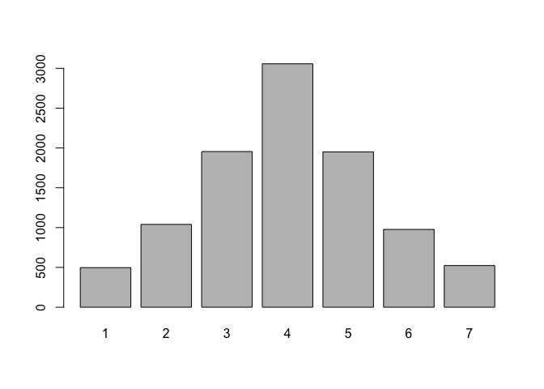

True Continuous Two-Factor Scale Appears Perfectly Unidimensional when
Discretized
================
Njål Foldnes and Steffen Grønneberg

## Introduction

Papers [\[1\]](#1) and [\[2\]](#2) investigate, among other things, the
extent to which the polychoric approach to factor and SEM analysis is
sensitive to violation of the underlying normality assumption for the
response vector. Here, we provide an example dataset (Xstar.csv) and R
code that strikingly illustrates the sensitivity of default ordinal SEM
estimation to underlying non-normality in the latent response variables.

The example is described in Paper [\[1\]](#1) as a case where a
two-factor continuous distribution will always be mis-interpreted as a
clean one-factor solution after discretization.

Also provided is a code file for the
simulation implemented in R, and here below readers may investigate (and experiment with) R code affirming
that indeed, 
ordinal data analysis yields a one-factor solution. At the end, the script also
illustrates that treating ordinal data as continuous is not always a
good idea, even with seven symmetrically distributed ordinal levels.

The conclusion is that factor retention will inevitably go wrong in this
scenario (the reader may change the number and placement of thresholds, and verify that this conclusion unfortunately remains).
Also, unfortunately,  there is no way to catch the underlying
non-normality using statistical tests on the ordinal dataset.
(The reader may apply function bootTest() in package [discnorm](https://cran.r-project.org/web/packages/discnorm/index.html) on X, and verify that it does not detect the non-normality in underlying marginals).


## Load Continuous Dataset and Confirm the Two-Factor Model

``` r
library(lavaan)
```

    ## This is lavaan 0.6-12
    ## lavaan is FREE software! Please report any bugs.

``` r
#load continuous 6 dimensional dataset - the true distribution
Xstar <- read.table("Xstar.csv", header=TRUE)

#confirm that this is a two-dimensional scale
ftwofactor <- cfa("F1=~ X1star+X2star+X3star; F2=~ X4star+X5star+X6star", data=Xstar,
                  estimator="MLM", std.lv=T)

fitmeasures(ftwofactor, c("pvalue.scaled", "rmsea.robust"))
```

    ## pvalue.scaled  rmsea.robust 
    ##         0.219         0.004

``` r
#but far from a one-dimensional scale
fonefactor <- cfa("F1=~ X1star+X2star+X3star+ X4star+X5star+X6star", data=Xstar,
                  estimator="MLM", std.lv=T)
fitmeasures(fonefactor, c("pvalue.scaled", "rmsea.robust"))
```

    ## pvalue.scaled  rmsea.robust 
    ##          0.00          0.24

``` r
#A chi-square difference test confirms the the one-factor model is untenable for continuous data
anova(fonefactor, ftwofactor)
```

    ## Scaled Chi-Squared Difference Test (method = "satorra.bentler.2001")
    ## 
    ## lavaan NOTE:
    ##     The "Chisq" column contains standard test statistics, not the
    ##     robust test that should be reported per model. A robust difference
    ##     test is a function of two standard (not robust) statistics.
    ##  
    ##            Df    AIC    BIC     Chisq Chisq diff Df diff Pr(>Chisq)    
    ## ftwofactor  8 140354 140447    6.1006                                  
    ## fonefactor  9 145525 145611 5178.9764        791       1  < 2.2e-16 ***
    ## ---
    ## Signif. codes:  0 '***' 0.001 '**' 0.01 '*' 0.05 '.' 0.1 ' ' 1

## Discretize to Seven Symmetrically Distributed Categories

Below we disretize, using a set of thresholds that yields nice ordinal
data distributions that are often recommended to be treated as
continuous. The user may experiment and specify any number thresholds
(using two thresholds for K=3, say) and placement of thresholds, without
changing the fact that a one-dimensional factor model will fit perfectly
when fitted to the ordinal data using categorical factor analysis.

``` r
probs <- c(.05, .1, .2, .3, .2, .1, .05 )
thr <- quantile(Xstar[, 1], probs=cumsum(probs))[-length(probs)] 

X123 <- apply(Xstar[, 1:3], 2,  FUN=cut, breaks=c(-Inf, thr, Inf), labels=F)
#thresholds yield ordinal data looks nice and "normal"
barplot(table(X123[, 1]))
```

<!-- -->

``` r
X456 <- apply(Xstar[, 4:6], 2,  FUN=cut, breaks=c(-Inf, -rev(thr), Inf), labels=F)
barplot(table(X456[, 2]))
```

<!-- -->

``` r
#ordinal datset stemming from Xstar
X <- data.frame(cbind(X123, X456)); colnames(X) <- paste0("X", 1:6)
```

## Categorical Factor Analysis Yields a One-Factor Solution!

``` r
##Correctly specified, but the two factors are (almost) perfectly correlated
ftwofactor_cat <- cfa("F1=~ X1+X2+X3; F2=~ X4+X5+X6", data=X,
                 ordered=colnames(X), std.lv=T)
subset(parameterestimates(ftwofactor_cat), lhs=="F1" & rhs=="F2")[, 1:4]
```

    ##    lhs op rhs   est
    ## 51  F1 ~~  F2 0.996

``` r
fitmeasures(ftwofactor_cat, c("pvalue.scaled", "rmsea.scaled"))
```

    ## pvalue.scaled  rmsea.scaled 
    ##          0.56          0.00

``` r
#The one factor model is suprisingly also correctly specified! 
fonefactor_cat <- cfa("F1=~ X1+X2+X3+X4+X5+X6", data=X,
                      ordered=colnames(X), std.lv=T)
fitmeasures(fonefactor_cat, c("pvalue.scaled", "rmsea.scaled"))
```

    ## pvalue.scaled  rmsea.scaled 
    ##         0.455         0.000

``` r
## DIFFTESTING CONFIRMS THAT ONE-FACTOR MODEL IS PREFERABLE
anova(fonefactor_cat, ftwofactor_cat)
```

    ## Scaled Chi-Squared Difference Test (method = "satorra.2000")
    ## 
    ## lavaan NOTE:
    ##     The "Chisq" column contains standard test statistics, not the
    ##     robust test that should be reported per model. A robust difference
    ##     test is a function of two standard (not robust) statistics.
    ##  
    ##                Df AIC BIC  Chisq Chisq diff Df diff Pr(>Chisq)
    ## ftwofactor_cat  8         2.5614                              
    ## fonefactor_cat  9         3.3504     1.9733       1     0.1601

## Treating Categorical Data as Continuous is not a Remedy

``` r
ftwofactor_cont <- cfa("F1=~ X1+X2+X3; F2=~ X4+X5+X6", data=X,
                      estimator="MLM", std.lv=T)
subset(parameterestimates(ftwofactor_cont), lhs=="F1" & rhs=="F2")[, 1:4]
```

    ##    lhs op rhs   est
    ## 15  F1 ~~  F2 0.996

``` r
fitmeasures(ftwofactor_cont, c("pvalue.scaled", "rmsea.scaled"))
```

    ## pvalue.scaled  rmsea.scaled 
    ##         0.541         0.000

``` r
#one factor model is correctly specified 
fonefactor_cont <- cfa( "F1=~ X1+X2+X3+X4+X5+X6", data=X,
                      estimator="MLM", std.lv=T)
fitmeasures(fonefactor_cont, c("pvalue.scaled", "rmsea.scaled"))
```

    ## pvalue.scaled  rmsea.scaled 
    ##         0.422         0.001

``` r
anova(fonefactor_cont, ftwofactor_cont)
```

    ## Scaled Chi-Squared Difference Test (method = "satorra.bentler.2001")
    ## 
    ## lavaan NOTE:
    ##     The "Chisq" column contains standard test statistics, not the
    ##     robust test that should be reported per model. A robust difference
    ##     test is a function of two standard (not robust) statistics.
    ##  
    ##                 Df    AIC    BIC  Chisq Chisq diff Df diff Pr(>Chisq)
    ## ftwofactor_cont  8 174032 174126 7.0720                              
    ## fonefactor_cont  9 174032 174119 9.3465     2.1825       1     0.1396

Chi-square difference testing indeed confirms that a one-factor solution
is preferable.

## References

<a id="1">\[1\]</a> Grønneberg, S., & Foldnes, N. (2022). Factor
analyzing ordinal items requires substantive knowledge of response
marginals. Psychological Methods.

<a id="2">\[1\]</a> Foldnes, N., & Grønneberg, S. (2021). The
sensitivity of structural equation modeling with ordinal data to
underlying non-normality and observed distributional forms.
Psychological Methods.
